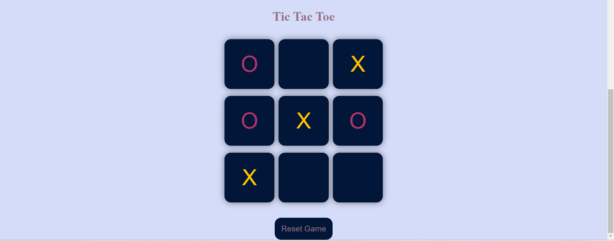
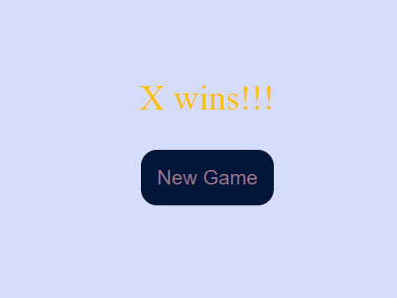
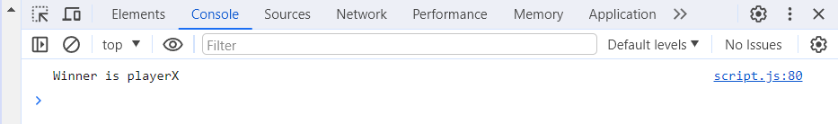
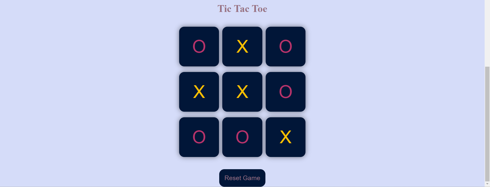
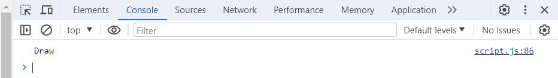
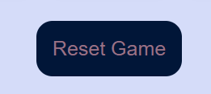
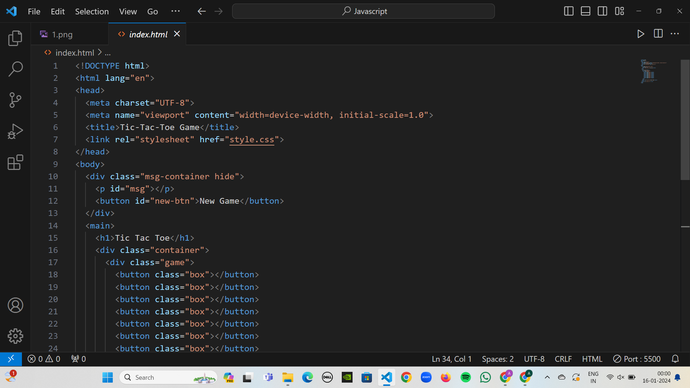
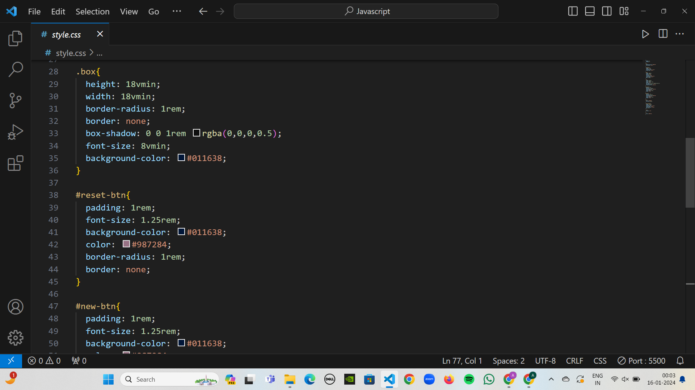
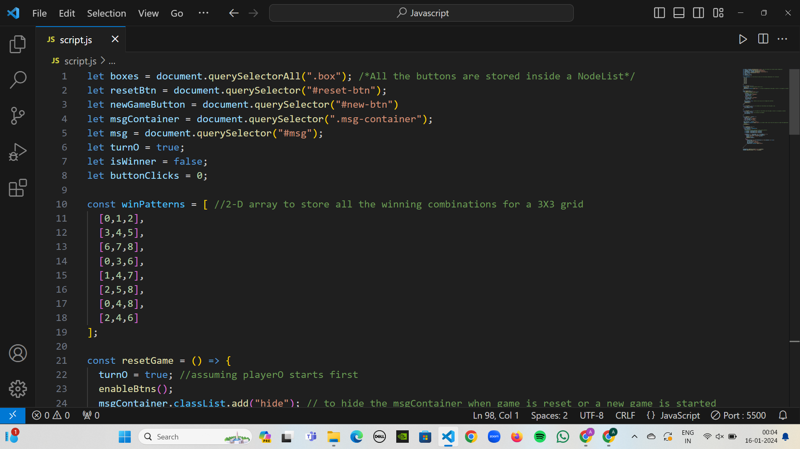

# Tic-Tac-Toe
A 3X3 Tic-Tac-Toe game for 2 players created using HTML, CSS and JS.

In this project, I have made a 3X3 Tic-Tac-Toe game for 2 players (playerX and playerO) using HTML, CSS and JavaScript. 
<h1>Rules for Tic-Tac-Toe</h1>

<ol>
  <li>A Tic-Tac-Toe game is fairly easy to play and understand.</li>
  <li>It consists of a grid of 9 boxes and two players - "X" and "O" take turns alternatively to fill this grid using their respective symbols.</li>
  <li>The aim is to ultimately get a streak of three same symbols adjacent to one another. This can form row-wise, column-wise or even diagonal-wise.</li>
  <li>The player able to form this streak, using their own symbol (either "X" or "O") wins the game.</li>
</ol>
<h1>Winning the Game</h1>

In the above scenario, playerX wins the game (diagonal-wise streak).

The above message is displayed. The players also have an option to start a "New Game".

A message is also printed out on the JS Console stating the winner. 
The game can also result in a "Draw" when none of the players are able to get a streak of the same 3 adjacent symbols.

The above scenario shows a draw or a tie match.

The above message is displayed. The players also have an option to start a "New Game".

The above message is also printed out on the JS Developer Console stating that the game resulted in a draw.
<h1>Game Reset Button</h1>

The game also consists of a "Reset Game" button to restart the game mid-way, if the players wish to restart the game.
<h1>IDE used - Visual Studio Code (VS Code)</h1>

 
<i><b>So, I really hope that you liked exploring this project of mine. Also, please do spend some time to try out the game with another friend.😊</b></i>

